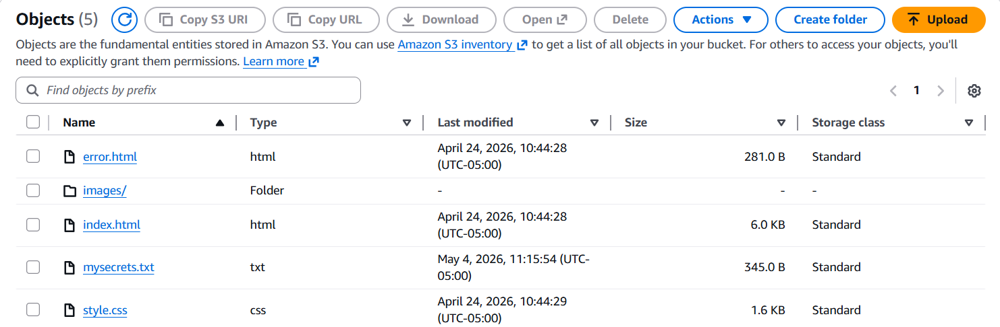
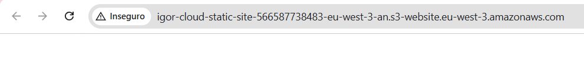
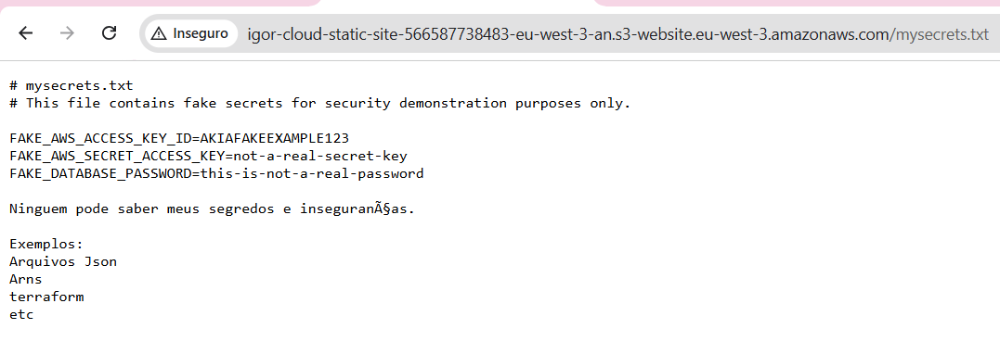
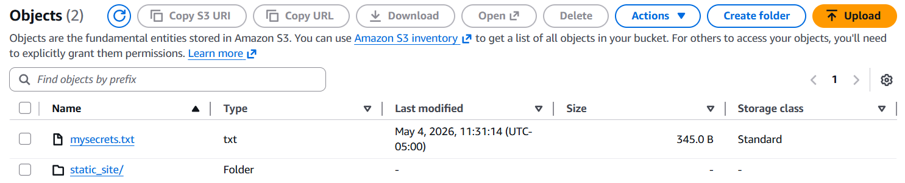
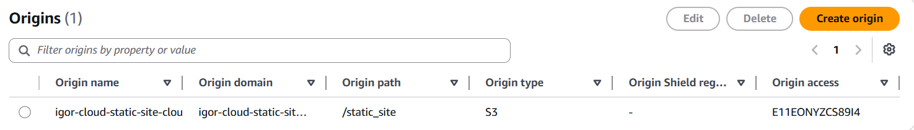
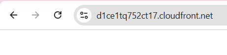
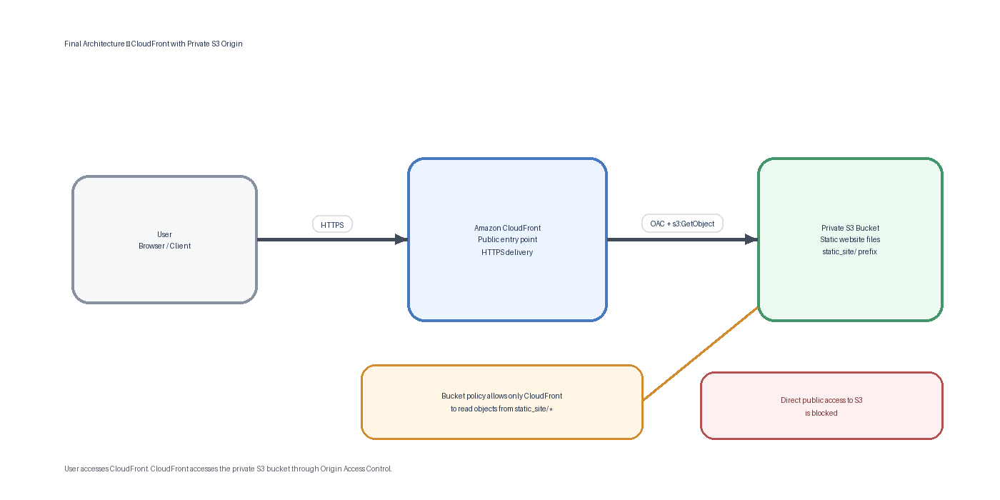

# Console-Based Development Phase

This phase of the project was developed manually through the AWS Management Console. The goal was to understand the core AWS services, configuration steps, access control decisions, and security implications before automating the infrastructure with tools such as Terraform.

During this console-based development phase, the project followed two architectural paths.

The first path used the S3 bucket itself as the public website endpoint. In this version, the static website was served directly from Amazon S3 using Static Website Hosting. This approach was useful to understand the basic behavior of S3 as a website host, but it also exposed important security limitations, such as the need for public access and the lack of native HTTPS support on the S3 website endpoint.

The second path introduced Amazon CloudFront in front of the S3 bucket. In this version, CloudFront became the public entry point of the website, while the S3 bucket remained private and protected. This architecture provided a more secure model by hiding direct access to the bucket, using HTTPS, and restricting CloudFront access only to the required website files.

## S3 as a endpoint

The images below show the initial architecture, where Amazon S3 was used as the public website endpoint through S3 Static Website Hosting.

This first approach helped demonstrate the basic behavior of hosting a static website directly from an S3 bucket. However, it also made the security limitations clear: the bucket required public access, the website endpoint used HTTP instead of HTTPS, and any object covered by the public bucket policy could potentially be accessed directly through its URL.

These images document the problems identified in the first version and explain why the architecture was later improved by adding CloudFront, HTTPS, and a private S3 origin.

  

  <em>Figure 1 — Files inside the S3 bucket in the first version.</em>

  

  <em>Figure 2 — No https protocol</em>

  

  <em>Figure 3 — Fake sensitive file exposed through the public S3 website endpoint.</em>

## Using CloudFront as a Secure Access Layer for S3

The images below show the second version of the architecture, where Amazon CloudFront was used as an intermediary layer between the user and the S3 bucket.

In this approach, users no longer access the S3 bucket directly. Instead, CloudFront becomes the public entry point of the website, while the S3 bucket remains private and protected behind Origin Access Control.

This architecture provides several security benefits. It allows the website to be delivered over HTTPS, reduces direct exposure of the S3 bucket, and restricts access only to the objects required for the static website.

The images below illustrate the benefits of using CloudFront in this architecture and show how this approach improves the security model compared to the initial public S3 endpoint version.

  

  <em>Figure 4 — Object structure inside the private S3 bucket in the second version.</em>

  

  <em>Figure 5 — CloudFront origin configuration pointing only to the static_site prefix inside the S3 bucket.</em>

  

  <em>Figure 6 — Static website delivered securely through CloudFront using HTTPS.</em>

## Final architecture

The diagram below shows the final architecture implemented in this project. In this version, users access the static website through Amazon CloudFront over HTTPS, while the S3 bucket remains private and protected behind Origin Access Control.

CloudFront works as the public access layer, and the S3 bucket is used only as the private origin for the website files stored inside the <code>static_site/</code> prefix.

  

  <em>Figure 7 — Final architecture using CloudFront as the public access layer and a private S3 bucket as the origin.</em>

